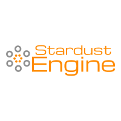

### Project Mission: A brand new, easy to use, and beautiful game engine for the PSP.

## Project Phase
The engine is currently in planning and will be moving to development on 3/3/2020.

## The Engine
The engine aims to be designed similar in architecture to Unity3D and features many similarities. Many of these similarities include GameObjects, Components, and Extensible Scripting. 

The engine will come in 3 options, each more powerful than the previous (and in reverse order of release).

The first option is a full editor with graphical interface that can be used to make a playable game with very minimal scripting required.
The second option is an interpreter with full scripting support that can be used to make quick and effective games with little to no experience required.
The third option is a highly performant and fast C++ API that can be used for complete control and efficiency.

The engine is broken up into multiple submodules that make up the engine, and the following are those key sub-components:

- Math
- Utilities
- Events
- Networking
- Core Engine
- Scene Management
- Scripting
- Profiling
- Audio
- Rendering
- Sprites
- 2D Lighting
- UI
- 2D Controllers
- 2D Physics
- Animations
- Particles
- Post Processing
- 3D Rendering
- 3D Lighting
- 3D Physics
- 3D Controllers
- Editor

## Schedule
While not much is known, since development hasn't started, and won't kick off until 3/3/2020, it is estimated that completion will come in early fall of 2020, but that is subject to change. After a few weeks, this will be updated with a full roadmap.

